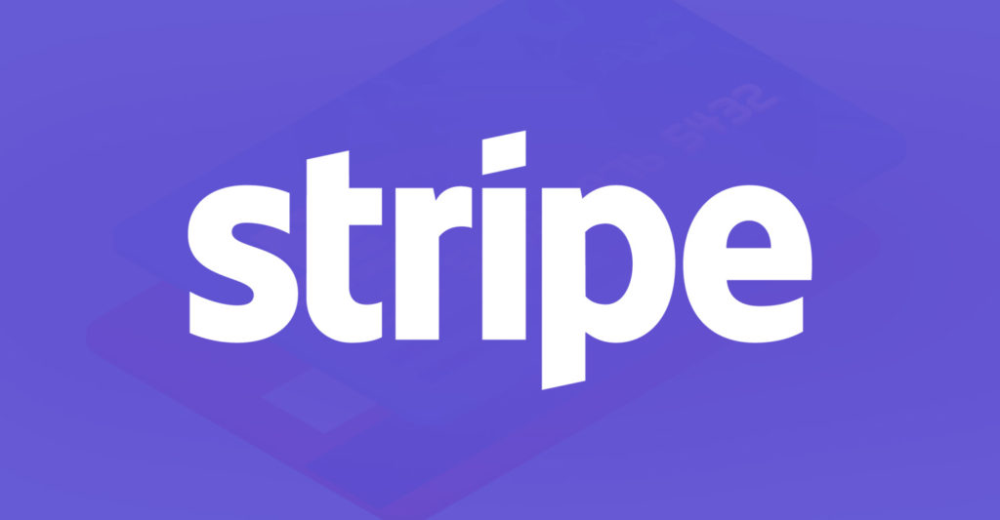

# Stripe
Stripe Case Study

## Overview and Origin:
* Stripe, Inc.
* Stripe was founded in 2010 by Patrick Collison and John Collison, two Irish-born brothers who both dropped out of Ivy League schools MIT and Harvard. The idea of came to them when they pondered why it was so difficult to accept payments over the web. Their plan was to make it really simple. Over the next 6 months they experimented with the idea and tinkered user friendly interfaces with friends, and studied their interactions along the way.[Startupgrind,2020]
* Stripe originally sought out investers to build their idea and gain credibility, in their eyes they "didn't look great on paper." SO, they started to grow their idea through word of mouth through friends, which cought momentum since all other platforms were so difficult to use. The Collison brothers finally received investing from Paul Graham of Y Combinator. Paul beilieved this to be an easy decision from making money off Patrick's previous company. The next summer after gaining business insights from the founder of PayPal, they were able to raise $2 Million of investments. Jumping forward to April 2019 they have raised to $600 Million by big companies like Sequoia Capital, General Catalyst and Andreessen Horowitz, and valuated at $35 Billion!!![Startupgrind,2020]  
*  Most of their revenue is made through fees it charges to their customers. These fees due vary from which bundle of service customers use and also on payment volume. Their standard structure is 2.9% + 30¢ per successfully executed payement transaction.[CBInsight,2020]

## Business Activities:
* Stripe is an American financial services and software as a service (SaaS)company that hopes to simplify the online payment process and expand the online platform for businesses, startups, and entrepeneurs.[Wikipedia,2020]
* Stripes intended customer base would primarily be businesses, startups, and entrepeneurs that are seeking a simpler way to handle the payment process of their company. The market size for Stripe is huge, seeing how there are over 30 Million businesses in the US, and most of these businesses do not have a good centralized system to process payments.[Forbes,2019]
* Businesses, startups, and entrepeneurs should use Stripe's platform of services because it seems to be offering multiple tools that may be of use other than just payments. A few features include:
    - Connect: the ability to create a marketplace
    for buyers and sellers to work together.[WPsimpepay,2020]
        * Programmable APIs are used to help assist payments on these marketplaces for buyer/seller.[Stripe_connect,2020]

    - Radar: a tool that utilizes Machine-Learning technologies to help detect and prevent fraud.[WPsimpepay,2020]
        * Radar's algorithms help adapt quickly to shifting fraud patterns as well to each unique business.[Stripe_radar,2020]

    - Terminal: Allows your online business to have a physical presence with point-of-sale technology.[WPsimpepay,2020]
        * Enables you to build your own point-of-sale platform as well as checkout experiences, including email customization and splash screens.[Stripe_terminal,2020]

    - Sigma: A SQL-powered analytics tool.[WPsimpepay,2020]
        * Quickly access pre-written queries to analyze data for most informative reports for different types of businesses.[Stripe_sigma,2020]

## Landscape:
* Stripe is striving towards the future of Payments/Billings domain, while implementing the use of FinTech.
* Much like Stripe, other competitors have implemented FinTech into it's business model to further the ways we use online payments and billings. Trending innovations over the last 5-10 years have been being able to store payment information on your phones when using companies services. Stripe allows you to store info for payment and use your phone as your wallet.
    - For example:Lyft allows you to save credit card info to allow you to easily pay for ride.

* Big Competitors: Square, Paypal, Adyen.[Fundera,2020]
## Results:
### Positive 
    * Today Stripe has helped businesses, startup, and entrepeneurs have easy access to the online platform for paying their sellers and bill their buyers.
    * Higher revenue of 6.7% 
    * Higher developer productivity
    * Less need for each company to build their own payment platforms
[IDC,2018]
### Negative
    * With almost instantaneous checkout processes, consumers expectations have changed as well.
    * Fraud is still a problem with hackers/scammers on the internet.

* Stripe not only works with smaller businesses, but also Fortune 500s like Amazon, Google, and Microsoft use Stripe as a platform. Square follows in second behind Stripe.
* Stripe stands apart from competitors not only in value in the company, but by wanting to grow the online commerce to a whole new level![CBInsight_2,2020]

## Recommendations
* My recommendation would be to have them implement FinTech to help them target companies that have high "average days out" because customers are not paying on time, due to the inconvenience of payment methods, such as bounced checks, or cards declining.
    - Pandas could be used to grab data from income statements, most likely from smaller business, to determine a high rate on "average days out". Then Stripe would be able to offer their platform for businesses struggling to collect from their customers, and provide an easy, reliable way to recieve money and pay bills on time.

### Sources:

[Startupgrind,2020](https://www.startupgrind.com/blog/the-collison-brothers-and-story-behind-the-founding-of-stripe/)

[CBInsight,2020](https://www.cbinsights.com/research/report/stripe-teardown/#:~:text=Stripe%20makes%20money%20from%20the,per%20successfully%20executed%20payment%20transaction)

[WPsimpepay,2020](https://wpsimplepay.com/9-unique-things-you-didnt-know-about-stripe/)

[Wikipedia,2020](https://en.wikipedia.org/wiki/Stripe_(company)) 

[Forbes,2019](https://www.forbes.com/sites/jeffkauflin/2019/02/04/the-10-biggest-fintech-companies-in-america-2019/#32f1f88932b9)

[Stripe_connect,2020](https://stripe.com/connect)

[Stripe_sigma,2020](https://stripe.com/sigma)

[Stripe_terminal,2020](https://stripe.com/terminal)

[Stripe_radar,2020](https://stripe.com/radar)

[Fundera,2020](https://www.fundera.com/blog/stripe-competitors)

[IDC,2018](https://stripe.com/files/payments/IDC_Business_Value_of_Stripe_Platform_Full%20Study.pdf)

[CBInsight_2,2020](https://www.cbinsights.com/research/report/stripe-teardown/)